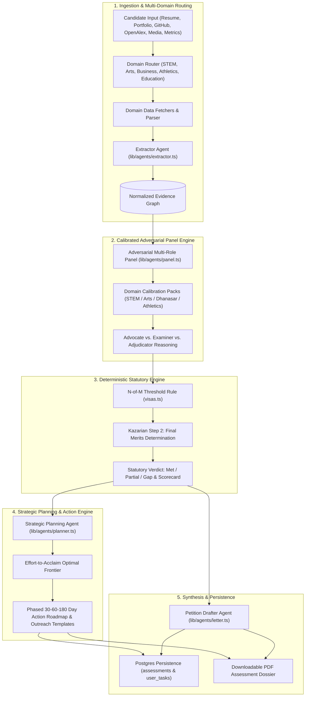

# Final Implementation Plan: Caliber Multi-Domain Visa Engine & Strategic Planning Agent

This design document establishes the final technical implementation plan to evolve Caliber into a **multi-domain visa assessment and strategic planning platform**, supporting **STEM, Arts & Design (O-1B), Founders & Executives (O-1A/NIW), Athletics, and Education**.

---

## 1. System Architecture Overview



---

## 2. User Review Required

> [!IMPORTANT]
> **Rate Limit Budget Safeguard**: We maintain the project's $\le 3$ LLM call budget per assessment run:
> 1. Call 1: `Extractor Agent` (evidence normalization)
> 2. Call 2: `Adversarial Panel Agent` (domain-calibrated evaluation of all criteria)
> 3. Call 3: `Strategic Planning Agent` OR `Petition Drafter Agent` (run on-demand or as final synthesis)

> [!NOTE]
> **Database Schema Migration**: `lib/db.ts` uses an idempotent `ensureSchema()` on startup. We will add `assessments` and `user_tasks` tables without requiring downtime.

---

## 3. Proposed Codebase Changes

### Component 1: Multi-Domain Rule Packs & Calibration

#### [MODIFY] [lib/visas.ts](file:///Users/prateek07/Workspace/projects/openatlas/lib/visas.ts)
- Add domain tags (`domain: "stem" | "arts" | "business" | "athletics" | "education" | "all"`) to each visa.
- Add specific criteria metadata for O-1B (Arts/Design/Media) and EB-2 NIW (*Matter of Dhanasar* 3 prongs).
- Add helper functions to query visas by domain and retrieve domain-specific evidentiary guidelines.

#### [MODIFY] [lib/agents/panel.ts](file:///Users/prateek07/Workspace/projects/openatlas/lib/agents/panel.ts)
- Implement `getDomainCalibration(domain, visaId)` injecting tailored standards of review:
  - **Arts/Design (O-1B & EB-1A Arts)**: Evaluates festival laurels, tier-1 critical reviews (*Variety*, *NYT Arts*), gallery exhibitions, streaming volume, and expert testimonials.
  - **Business & Founders (O-1A Business & EB-2 NIW)**: Evaluates venture funding, enterprise ARR, user growth, patents, and regional economic impact under *Matter of Dhanasar*.
  - **STEM/Research (O-1A & EB-1A/EB-1B)**: Evaluates peer-reviewed journals, citation velocity, and field impact.
- Implement **Kazarian Two-Step final merits evaluation** in the deterministic output aggregator.

---

### Component 2: Strategic Planning Agent ("Visa Runway Co-Pilot")

#### [NEW] [lib/agents/planner.ts](file:///Users/prateek07/Workspace/projects/openatlas/lib/agents/planner.ts)
- Create the Planning Agent that takes `EvidenceItem[]`, `PanelResult`, `Visa`, and `domain`.
- Calculates the **Effort-to-Acclaim frontier** across all `partial` and `gap` criteria.
- Returns a structured roadmap:
  ```typescript
  export type ActionTask = {
    id: string;
    criterionId: string;
    title: string;
    description: string;
    timeframe: "30_days" | "60_days" | "180_days";
    estimatedEffortHours: number;
    expectedEvidentiaryProof: string;
    outreachTemplate?: string; // Ready-to-use email pitch or draft letter
  };

  export type PlanResult = {
    targetCriteria: string[];
    strategyRationale: string;
    timeToEligibilityMonths: number;
    phases: {
      phase: string;
      timeframe: string;
      tasks: ActionTask[];
    }[];
  };
  ```

#### [NEW] [app/api/plan/route.ts](file:///Users/prateek07/Workspace/projects/openatlas/app/api/plan/route.ts)
- Authenticated Next.js API route that triggers `generatePlan(...)`.

---

### Component 3: Data Ingestion & Wage Normalization

#### [NEW] [lib/sources/bls.ts](file:///Users/prateek07/Workspace/projects/openatlas/lib/sources/bls.ts)
- Add deterministic BLS OEWS wage benchmark lookup for common SOC codes (tech, arts/media, management, science) to accurately evaluate the 90th percentile salary threshold.

#### [MODIFY] [lib/agents/extractor.ts](file:///Users/prateek07/Workspace/projects/openatlas/lib/agents/extractor.ts)
- Support qualitative media links (IMDb, Spotify, press portfolios, articles) and business impact metrics (funding, revenue, role stature) in addition to GitHub and OpenAlex.

---

### Component 4: Database Persistence & Task Tracking

#### [MODIFY] [lib/db.ts](file:///Users/prateek07/Workspace/projects/openatlas/lib/db.ts)
- Extend `ensureSchema()` with:
  ```sql
  CREATE TABLE IF NOT EXISTS assessments (
    id TEXT PRIMARY KEY,
    user_email TEXT NOT NULL,
    visa_id TEXT NOT NULL,
    domain TEXT NOT NULL,
    result JSONB NOT NULL,
    created_at TIMESTAMP WITH TIME ZONE DEFAULT NOW()
  );

  CREATE TABLE IF NOT EXISTS user_tasks (
    id TEXT PRIMARY KEY,
    user_email TEXT NOT NULL,
    assessment_id TEXT NOT NULL,
    criterion_id TEXT NOT NULL,
    title TEXT NOT NULL,
    description TEXT NOT NULL,
    timeframe TEXT NOT NULL,
    completed BOOLEAN DEFAULT FALSE,
    outreach_template TEXT,
    created_at TIMESTAMP WITH TIME ZONE DEFAULT NOW()
  );
  ```

#### [NEW] [app/api/assessments/route.ts](file:///Users/prateek07/Workspace/projects/openatlas/app/api/assessments/route.ts)
- API route to list, save, and fetch past assessments and task checkoffs.

---

### Component 5: User Interface & Experience

#### [MODIFY] [app/assess/new/[visa]/AssessmentForm.tsx](file:///Users/prateek07/Workspace/projects/openatlas/app/assess/new/[visa]/AssessmentForm.tsx)
- Add domain archetype selector (STEM, Arts & Design, Founders & Business, Athletics, Education).
- Render domain-specific input fields (e.g. IMDb/portfolio links for Arts; revenue/funding for Founders).

#### [NEW] [app/assess/new/[visa]/RoadmapView.tsx](file:///Users/prateek07/Workspace/projects/openatlas/app/assess/new/[visa]/RoadmapView.tsx)
- Renders the interactive 30-60-180 day sprint roadmap.
- Includes expandable task cards, pre-drafted email templates (with one-click copy), and interactive completion checkboxes.

#### [MODIFY] [app/assess/page.tsx](file:///Users/prateek07/Workspace/projects/openatlas/app/assess/page.tsx)
- Display previous assessment history, domain badges, and outstanding action tasks.

---

## 4. Verification Plan

### Automated Tests & Scripts
```bash
# 1. Typecheck the Next.js TypeScript project
npx tsc --noEmit

# 2. Test Planning Agent with multi-domain inputs
npx tsx scripts/test-planner.mts

# 3. Test multi-domain panel calibrations (Arts O-1B, NIW, STEM O-1A)
npx tsx scripts/test-panel.mts

# 4. Test database schema & persistence
npx tsx scripts/test-db.mts

# 5. Production build check
npm run build
```

### Manual User Verification
- **Test Case 1 (Arts / O-1B)**: Ingest an IMDb / portfolio profile; verify panel judges against *Distinction in the Arts* and generates an Arts-focused 60-day roadmap.
- **Test Case 2 (Founder / EB-2 NIW)**: Ingest startup metrics; verify panel assesses the 3 *Dhanasar* prongs and outputs investor/customer evidence tasks.
- **Test Case 3 (Interactive Checklist)**: Check off tasks in the UI; verify status persists to Postgres and dashboard refreshes seamlessly.
- **Test Case 4 (Print PDF)**: Export the complete dossier including the Action Plan and verify clean print styling.


MY CHAT SUMMARY: 
Here is a structured summary of our session and the strategic roadmap developed for Caliber:

Session Summary: Caliber Architecture & Feature Expansion
1. Codebase & Context Handbook Analysis
Core Philosophy: Evaluated the repository’s foundational principle — "AI proposes, code disposes", where LLMs extract qualitative evidence and argue criteria, while deterministic TypeScript code enforces statutory thresholds (8 CFR §204.5 / 214.2) and counting.
Handbook Insights (Caliber-Context-Handbook.pdf):
Rate Limit Budget: Strictly architected for free-tier constraints (Groq 
≤
3
≤3 calls per assessment: Extractor 
→
→ Batched Adversarial Panel 
→
→ Drafter/Planner).
Skeptical Standard of Review: Calibrated to reject non-qualifying student awards, hackathons, un-benchmarked salaries, and low-tier publications.
Tech Stack: Next.js 16 (App Router), React 19, Tailwind CSS v4, Auth.js (NextAuth v5), Postgres (postgres.js), and unpdf.
2. Key Innovations & Non-Wrapper Agentic Systems


┌────────────────────────────────────────────────────────────────────────┐
│                        CORE AGENT INNOVATIONS                          │
├─────────────────────────┬──────────────────────────────────────────────┤
│ 1. Multi-Domain Routing │ Ingests Arts/Design (IMDb, Portfolios) and   │
│    & Ingestion          │ Business/Founders (ARR, Funding, Metrics)    │
├─────────────────────────┼──────────────────────────────────────────────┤
│ 2. Domain Calibration   │ Injects O-1B Arts & EB-2 NIW Dhanasar        │
│    Packs                │ standards into the Adversarial Panel         │
├─────────────────────────┼──────────────────────────────────────────────┤
│ 3. Strategic Planning   │ Computes "Path of Least Resistance" to close │
│    Agent                │ criteria with 30-60-180 day action roadmaps  │
├─────────────────────────┼──────────────────────────────────────────────┤
│ 4. Grounded Wage Engine │ Direct BLS OEWS wage percentile normalizer   │
├─────────────────────────┼──────────────────────────────────────────────┤
│ 5. Task & Run DB        │ Postgres persistence for historical scores   │
│    Persistence          │ and interactive user milestone checkoffs     │
└─────────────────────────┴──────────────────────────────────────────────┘
3. Serving Immigrants Beyond STEM
We expanded the architecture to first-class support for non-technical fields:

Arts, Design, Film & Music (O-1B / EB-1A Arts): Evaluates festival laurels, gallery showcases, box office / streaming metrics, and reviews in tier-1 trade media (Variety, NYT Arts).
Entrepreneurs & Business Leaders (O-1A Business / EB-2 NIW): Evaluates venture backing, enterprise revenue/ARR growth, market adoption, and regional economic impact under the Matter of Dhanasar 3-prong framework.
Athletics & Education: Ingests tournament placements, national team selections, and curriculum adoption metrics.
4. The Strategic Planning Agent ("Visa Runway Co-Pilot")
Instead of passive static scorecards, the Planning Agent:

Evaluates the Optimal Frontier: Identifies which unmet criteria offer the highest acclaim ROI per hour of effort (e.g. Judging the Work of Others taking 30–45 days via peer review vs. 1+ years for major awards).
Generates Concrete Action Artifacts: Supplies pre-drafted outreach emails for journal editors/conference chairs, trade press pitch sheets, and independent expert recommender briefs.
Interactive Tracking: Powers an interactive checklist on /assess backed by Postgres so candidates can check off milestones as they achieve them.
5. Final Artifact Generated
Implementation Plan: Documented in 
implementation_plan.md
 with complete component file diff specifications, schemas, and verification smoke tests.
9:02 PM


